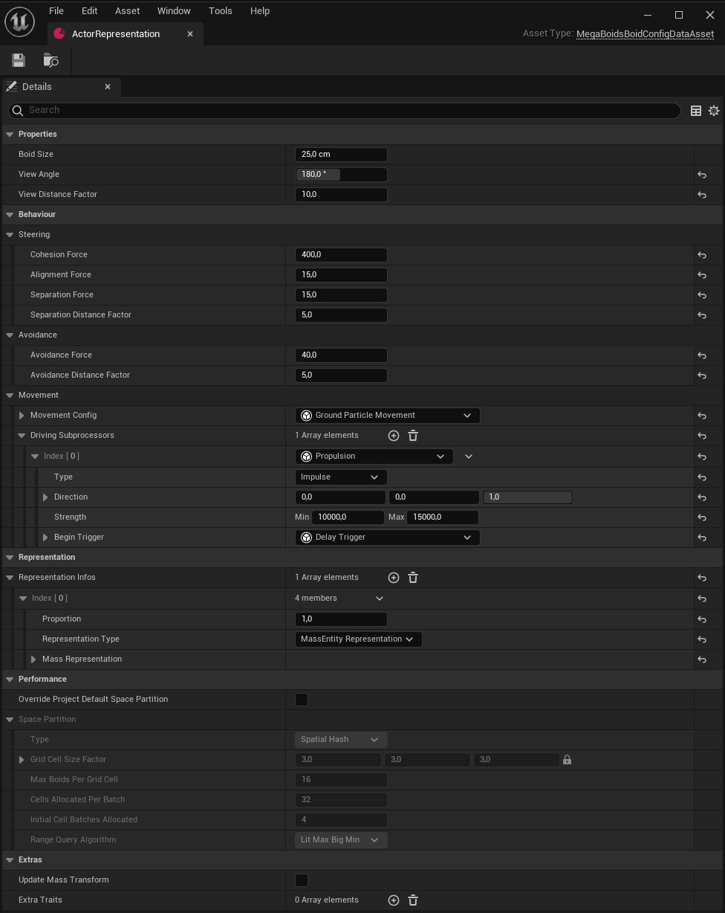
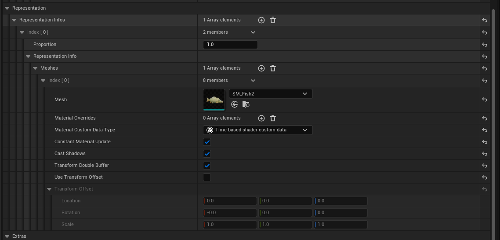

  

    Contents
  

  {: .text-delta }
- TOC
{:toc}

# Boid configuration
In MegaBoids, the core configuration of your entities takes place in a [Data Asset](https://dev.epicgames.com/documentation/en-us/unreal-engine/data-assets-in-unreal-engine), the 'Boid configuration data asset'. As expected, the data asset is meant to define the shared parameters of a type of boid. We mentioned [earlier](Basic-concepts) that boids movement starts with alignment, cohesion and separation and the data asset is where we can configure these properties' relative importance. You will spend a fair amount of time tweaking the strength of these forces but the boid config data asset also holds other important properties:

| Parameter | Description |
| :-------- | :---------- |
| Boid size | Radius of the boid sphere. Used to determine the "edge" of a boid for separation among other things. |
| View angle | Angle of the area the boid can see in front of him, in degrees. Along with 'View distance', this will determine which neighboring boids are used to compute basic steering forces. I.E. 180 degrees means the boids will see everything in front of him. 90 means a 90 degree angle cone, etc. |
| View distance factor | Maximum distance to which a boid can see his neighbors. Along with 'View angle', this will determine which neighboring boids are used to compute basic steering forces. This factor is a multiplier on the size of the boid so the distance the boid will see is 'Size * View distance'. |
| Cohesion force | Strength of the cohesion component of basic steering. The higher this value, the more the boid will steer towards the average location of its neighbors. |
| Alignment force | Strength of the alignment component of basic steering. The higher this value, the more the boid will steer to align its velocity with its neighbors' velocity. |
| Separation force | Strength of the separation component of basic steering. The stronger this value, the more the boid will steer away from its neighbors. |
| Separation distance factor | Distance factor at which a boid will see his neighbors in order to separate from them. This factor is a multiplier on the size of the boid so the distance the boid will separate is 'Size * Separation distance'. This value is independent from the 'View distance factor' so separation can apply at a different distance. However, the 'View angle' applies for separation. |
| Avoidance force | Strength of the avoidance component of steering. The stronger this value, the more the boid will steer away from obstacles, defined in the [spawner](Spawners-and-groups). |
| Avoidance distance factor | Distance factor at which a boid will see the obstacles around him and start avoiding them. This factor is a multiplier on the size of the boid so the distance the boid will separate is 'Size * Avoidance distance'.  This value is independent from the 'View distance factor' meaning you can see the environment independently from seeing your neighbors for steering. 'View angle' is not used for obstacle avoidance, only distance is considered. |
| Movement config | Movement model to use for the boid. More details [below](#the-movement-model). |
| Driving subprocessors | Basic driving subprocessors. These subprocessors define the "rest" or idle movement of the boid, independently from the environment in which it lives. |
| Representation infos | If you are rendering your boids as static meshes, this is where you would configure them. More details [below](#Representation). |
| Override Project Default Space Partition | Should the boids spawned with this configuration use different space partition settings from the project default? This can be overriden at the [spawner](Spawners-and-Groups) level too. |
| Space Partition | When overriding the project settings, use these space partition settings instead. See [space parition settings](Spawners-and-Groups#Space-Partition-Settings) for details. |
| Update Mass Transform | Should we also add/update the 'regular' Mass Transform for this boid? This might be required for interacting with other Mass systems and is automatic for Mass Representation. |
| Extra traits | Extra traits to assign to the boids when spawning it. These are regular [Mass Entity Traits](https://dev.epicgames.com/documentation/en-us/unreal-engine/overview-of-mass-entity-in-unreal-engine), typically used in a Mass Spawner. You can use these to inject other custom behaviors the regular Mass Entity way. More details in the [Technical documentation](Technical-reference) |

# Initialization
Initializing your boids is an important step to ensure they are in an adequate state when spawned. Most of the time, this would be environment dependent so best done in the [spawner](Spawners-and-groups).

> [!NOTE]
> You might have some default initialization to do, for instance, for the [per-instance custom data](#per-instance-custom-data). You can add these initializers to your boid configuration directly. This feature is planned but not yet implemented. Use the spawner initializers in the mean time.

> [!IMPORTANT]
> [Requires C++](Blueprint-support)
>
> Most initializers are very specific and rely on C++ data types. Therefore, it is very likely you will need custom initializers for your project. These are written in C++ because of limited Blueprint support in Mass Entity. We invite you to head to the [technical documentation](Technical-reference) for more information.

# Movement
Moving boids is all about summing up forces and then interpreting those forces in a coherent way in the [movement model](#the-movement-model). MegaBoids splits up the forces into three categories: steering, propulsion and environmental forces.

## Movement components
### Steering
From the data asset properties [above](#Boid-configuration), you probably figured out that the steering and avoidance forces are taken care of automatically by the basic plugin algorithm. They are the core of the boids algorithm after all, and you can get many different behaviors by tweaking the properties for cohesion, alignment and separation. For instance, having a short and narrow view angle along with strong cohesion and alignment makes for boids which tend to follow an orderly line. On the other hand, a far, 270 degree view with limited cohesion but strong alignment works better for larger, looser flocks.

Note that steering forces are always limited to the YZ plane  (left/right/up/down) and it is the movement model's responsibility to convert this vector force into rotation.

#### Avoidance
Boids generally need to be aware of their environment to avoid penetrating it. This is handled by the avoidance properties of the boid configuration. By modifying the 'Avoidance Distance Factor' and 'Avoidance Strength' you can alter how your boid reacts to obstacles. A short view distance and strong avoidance strength will result in entities that turn suddenly near obstacles. Alternatively, a further view distance will smooth out avoidance forces over distance. Obstacles are defined in the [spawners](Spawners-and-groups) because they live in the level and therefore need to reside in an actor. There is also avoidance with the spawner bounds so the boids try to remain within the specified region. Note that since we work only with forces within all the calculations, avoidance, just like penetration, is a soft constraint. There is no guarantee there will be no penetration, this is a not a physics collision to keep things performant. Avoidance forces are added to steering forces when passed to the movement model.

### Driving subprocessors
On top of the basic steering forces and avoidance, to give boids intention, you can also provide steering forces through the driving subprocessors. For instance, if you setup your boid group with leaders and followers, the latter will need to steer towards the leader they are following. The driving subprocessors can provide this information and it will be added to the steering force passed to the movement model.

#### Propulsion
Since the steering forces will only point in the YZ plane to steer the boid without moving it forward, we have a second component to handle propulsion. Contrary to steering forces, propulsion forces are not constrained to the YZ plane. Propulsion forces are provided by the [driving subprocessors](Driving-Subprocessors). You can therefore use driving subprocessors to add forces in any direction and their interpretation is left to the [movement model](#the-movement-model).

Propulsion forces are provided by driving subprocessors and because propulsion forces come from different sources, you can define them in two different locations: in the data asset and in the [spawner](Spawners-and-groups). Those in the data asset are considered the "idle" or default movement and are independent of environment. Those in the spawner are meant to give environment or scenario specific forces, they are considered as specialized movement forces.

We go in greater detail on how the provided driving subprocessors work in the [next page](Driving-subprocessors) as well as how to code your own in the [technical reference](Technical-reference).

### Environmental
The world around us is dynamic and has an external influence on the boids' movement. Birds use hot air currents to effortlessly gain some altitude and fish fight the current when swimming upstream. These forces push the boids around regardless of neighbors, orientation or other internal factors. Therefore, they are provided independently from steering forces.

## The Movement Model
Once we gathered all the forces that apply to a boid, we need to use those forces to update our transform and our velocity. Because different boids will move in different ways, the steering, propulsion and environmental forces apply differently for various configurations. For instance a gliding bird moves very differently from a walking soldier. The movement model takes care of this. It's role is to translate the three types of forces into movement.

MegaBoids provides a large set of different movement models but also allows you to code your own. See the [movement models page](Movement-Models) for details, as well as the [technical reference](Technical-reference) to extend the plugin for your project specific needs.

# Representation
Games wouldn't be much without graphics and the same applies to your finely tuned boids. You spent hours creating these amazing AIs but what good is it if they are not rendered? There are multiple different ways to go about presenting your entities on screen. MegaBoids provides a default implementation based on HISM ([hierarchical instanced static meshes](https://dev.epicgames.com/documentation/en-us/unreal-engine/instanced-static-mesh-component-in-unreal-engine#hierarchicalinstancedstaticmesh)) as well as an easy way to setup your entities to use the Mass Entity provided MassVisualization. You can also use [invisible boids](#Ghost-boids) as references to drive the movement of other boids within the same spawn group.

To configure your boid representation, use the 'Representation infos' field in the config asset. The MegaBoids system supports having different representations for a single boid configuration. Each representation has an associated proportion, or weight. The spawned boids will be spawned proportionally to the weights entered with the selected representation configuration. At the moment, we support two representations: HISM and MassRepresentation.

## HISM Representation
HISMs provide instanced rendering of static meshes with LOD support, giving you low GPU usage so you can have all the entities you require on screen. On top of that, each representation can have up to 4 meshes to do a simple composition. Although it is available and sometimes useful, *it is much better to use a single merged mesh to improve performance*. You also need to keep in mind that the boids keep the same estimated boid size so their representation meshes should respect it. Nevertheless, each representation mesh has the following properties:

| Parameter | Description |
| :-------- | :---------- |
| Mesh | Static mesh used to render your boid. |
| Material overrides | Override for the materials of 'Mesh'. Same as the override in the Static Mesh Component. Order is important if 'Mesh' uses multiple materials. |
| Material custom data type | Struct type of your per-instance custom data. See [below](#per-instance-custom-data) for details. |
| Constant material update | Does your per-instance custom data need to be updated at every frame? This is mostly used for [animation](#animation). |
| Cast shadows | Does the boid cast shadows? |
| Transform double buffer | Should the boid be rendered with double buffered transform? This can reduce motion trails at the expense of performance. |
| Use transform offset | Do you want to offset the 'Mesh' from it's pivot? This exposes a transform that will be applied to your boid representation. Note that this implies extra computations and it is therefore recommended that you apply your transform directly to your mesh instead. |
| Transform offset | If 'Use transform offset' is enabled, apply this transform to your boids representation. |

Since all boids share the same static mesh within a representation, it could look artificial and repetitive. You can change the look of each instance and add variety, using [per-instance custom data](#per-instance-custom-data) in your shader. MegaBoids also offers mix-and-matching different boid configurations within the spawner. You can learn more on this feature in the [Spawners and Groups](Spawners-and-groups) page.

### Per-instance custom data
Within a representation mesh settings, one particular property in your boid configuration is very useful for some extra features and adding natural variation to entities. As mentioned in the previous section, you can specify what struct to hold your per-instance custom data. This [feature of instanced static meshes](https://dev.epicgames.com/documentation/en-us/unreal-engine/instanced-static-mesh-component-in-unreal-engine#customdata) is used to add variety to your instances. Common use-cases include adding variations like changing color or size but more advanced scenarios can also be achieved, like vertex or shader animation.

Per-instance custom data takes the form of an array of 32-bit floats that is passed to the shader. We will not go into details on how to use custom data but MegaBoids will attach the provided struct to each entity. This data will get sent to the GPU on your behalf but, because it requires work to push the updated custom data to the GPU, it is not updated automatically. If you require updating it every frame (typically for [animation](#Animation)), you can use the 'Constant material update' flag and MegaBoids will do the heavy lifting for you. Otherwise, you need to flag your entity for custom data update using a [Mass Entity command](https://dev.epicgames.com/documentation/en-us/unreal-engine/overview-of-mass-entity-in-unreal-engine). More details in the [technical documentation](Technical-reference).

Initializing your custom data should be done in an [initializer](#Initialization).

### Animation
As mentioned previously, you can use per-instance custom data to animate your boids on the GPU, at the shader level. It is way beyond the scope of MegaBoids to offer a full fledged shader-based animation system. We would definitely like to offer such a solution in the future but haven't got to it yet. However, we demonstrate how it can be achieved in the demo to help get you started. You can see some bouncy balls and fish being animated with a simple shader as well as the butterflies implementing texture based vertex animation.

> [!IMPORTANT]
> [Requires C++](Blueprint-support)
> 
> Because accessing data in Mass Entity requires writing C++, we consider this a more advanced and technical operation. Suffice to say that you can access your per-instance custom data to update it from within a driving or movement subprocessors, or any other [Mass Entity processor](https://dev.epicgames.com/documentation/en-us/unreal-engine/overview-of-mass-entity-in-unreal-engine). More details available in the [technical documentation](Technical-reference).

## Actors (Mass Visualization)
Mass Entity is a framework that aims to move away from the actor-component model in order to achieve better performance. With that in mind, MegaBoids offers a representation solution based on instanced static meshes. We built this plugin with ambient AI in mind (where static meshes are often preferable) while ensuring it is not limited to this particular use-case. Because Mass Entity offers a solution to attach actors to entities, we made sure to support this feature as well. To do so, you will have to select the MassRepresentation type of representation and configure them according to your needs. In the configuration for MassRepresentation you will find fields for 3 LODs: high resolution, low resolution and static mesh. You can also configure the LOD distances as well as what type of representation is used for each LOD level. Make sure to check out this demo to see how to configure your boids for an actor based representation.

> [!NOTE]
> Mass Entity in Unreal Engine 5.1 has it's share of issues and was far from an easy to use product. You will need to activate some processors manually in the Mass project settings in order for the actor representation to work properly with LODs. Check out the DefaultMass.ini file in the demo.

## Ghost boids
Most of the time you will want your boids rendered of course. However, it is absolutely valid to have "ghost" boids in some situations. Ghost boids are simply boids without a visual representation. Leave the representation infos empty and the boids will be simulated but not rendered. You can use such boids to drive [boids of another configuration](Spawners-and-groups#group-composition). For instance, you could use the 'Follow the leader' driving subprocessor with ghost leaders and your "real" boids as followers, producing a coherent complex group behaviour that would be harder to achieve otherwise.
