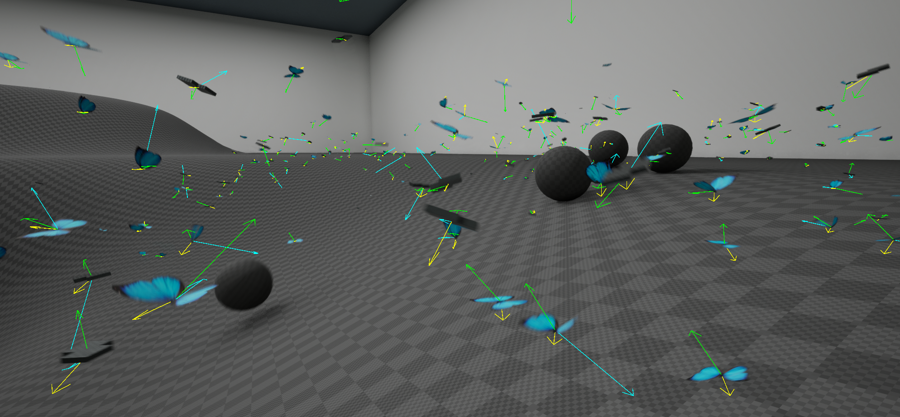

# Boids
First developed by Craig Reynolds in 1986, boids[1](#Ref1) (short for bird-oids) are a common algorithm in video game NPC AI. They are typically used to simulate groups of animals, oftentimes school of fish or flock of birds. However, the core principles of the boids algorithm work well for most type of cohesive group movement when tuned right.

The basic elements of boid movement is composed of three parts: alignment, cohesion and separation. In our implementation, the three elements as well as an avoidance force (to navigate around environment obstacles) add up based on the boid configuration and result in a vector force that takes care of steering (left-right & up-down). To give purpose to the boid entities, we also compute a driving force which handles propulsion ("forward" movement). Finally, environment forces are external forces that act on the boid. Steering, environment and driving forces are then aggregated in a cohesive manner within a movement model that updates the location and orientation of the entity.

We will go into more details on how to configure a boid in the next section, [Anatomy of a boid](Anatomy-of-a-boid). For implementation details and to learn how to extend the plugin for your own needs, head to the [technical reference](Technical-reference).

# Contents
1. [Anatomy of a Boid](Anatomy-of-a-boid)
1. [Driving forces](Driving-Subprocessors)
1. [Environment forces](Envoronment-Subprocessors)
1. [Movement Models](Movement-Models)
1. [Spawners and Groups](Spawners-and-groups)
1. [Project Settings](Project-Settings)

***

# References
<a name="Ref1">1.</a> Wikipedia, Boids, April 13th, 2025, https://en.wikipedia.org/wiki/Boids