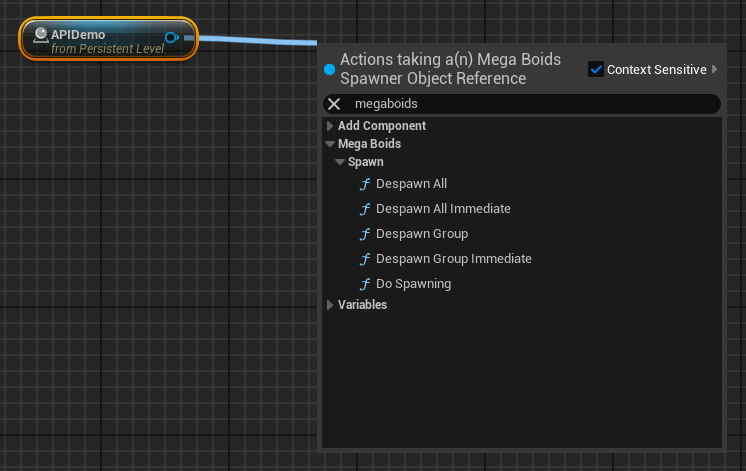
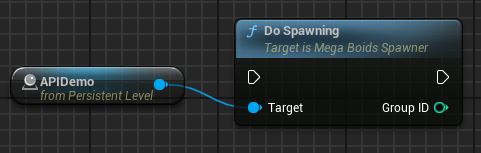
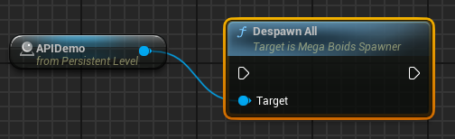

  

    Contents
  

  {: .text-delta }
- TOC
{:toc}

# Blueprint API

Some functions of the plugin are be exposed through blueprint but the blueprint API is fairly limited. This is due to [blueprint support in the Mass Entity framework](#Extending-the-plugin-Mass-Entity-blueprint-support).
The blueprint API is curently limited to spawning and despawning and can be accessed through the [spawner actor](Spawner-and-Groups).

| Function | Details | |
| :-------- | :---------- | :---------- |
| Do Spawning | Spawns the group for which the spawner is configured.  **<ins>Return value</ins>** _Group ID_: ID of the group that was spawned or -1 if it failed |  |
| Despawn Group | Schedules a despawn request for the group with the provided ID.  **<ins>Parameters</ins>** _Group ID_: Id of the group to despawn, as returned by 'Do Spawning' |  |
| Despawn Group Immediate | Despawn the group with the provided ID immediately. This is an unsafe call to do on the game thread as there might be background tasks currently running. **Users should preferably use the non-immediate version.**  **<ins>Parameters</ins>** _Group ID_: Id of the group to despawn, as returned by 'Do Spawning' |  |
| Despawn All | Schedules a despawn request for the all groups that were instanciated with this spawner. |  |
| Despawn All Immediate | Despawn all groups that were instanciated with this spawner immediately. This is an unsafe call to do on the game thread as there might be background tasks currently running. **Users should preferably use the non-immediate version.** |  |

> [!NOTE]
> More Blueprint functions will be provided in the future for finer control over boids. We are currently planning to add raycasting, spawning and despawning without a spawner reference in order to support more complex gameplay scenarios.

# Extending the plugin & Mass Entity blueprint support

MegaBoids is a plugin based on the Mass Entity framework. Unfortunately, Mass Entity is currently **not compatible** with [Unreal Blueprints](https://dev.epicgames.com/documentation/en-us/unreal-engine/blueprints-visual-scripting-in-unreal-engine) and it seems unlikely it ever will given some core design choices from Epic when developing Mass Entity. There is currently no way to create or access data types from blueprint, since they are built upon a C++ feature called 'templates'. Therefore, the following plugin extensions must absolutely be added through our C++ API:
* Driving subprocessors
* Environment subprocessors
* Initialization subprocessors
* Movement models

This is a good opportunity for you to learn C++. We put a lot of effort into abstracting the concepts of Mass Entity in a digestible manner such that developers can focus on what matters to them; making great games! If all else fails, check out our [consulting services](About-MegaPunk-Games#consulting-and-help).
