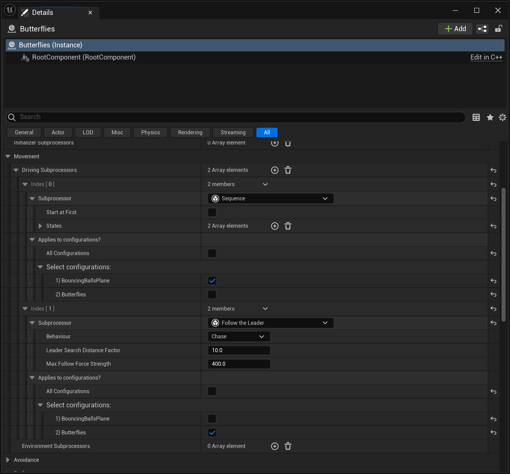
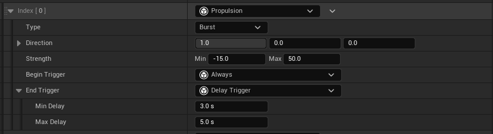
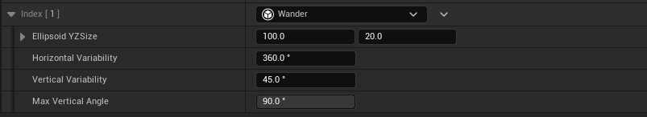

  

    Contents
  

  {: .text-delta }
- TOC
{:toc}

# Driving subprocessors
Driving subprocessors are aptly named since they are meant to provide conscious driving forces. Steering forces by themselves leave you with a pack of useless, floating entities since nothing is driving them forward. In nature, birds flap their wings and fish wag their tail to move forward; they have some mechanism to produce a propulsion force. The driving subprocessors are meant to provide both steering and propulsion.

Steering and propulsion forces are different because there is no restriction on the direction of propulsion forces whereas steering forces are limited to the YZ plane. Propulsion is not limited to the forward direction because living being can also strafe or jump sideways. Therefore, we do not want to limit these forces to a single direction and it will be the movement model's responsibility to handle this properly. We also do not want to restrict where you define these forces because some are part of the basic movement of the boid but oftentimes it's environment or use-case specific. Therefore, you can determine driving subprocessors on both the data asset and on the [spawner](Spawners-and-groups).

## "Idle" Driving Forces
On the boid [config data asset](Anatomy-of-a-boid#boid-configuration), you will find a list of driving subprocessors. These define the idle, or default, forces to apply to your boid. You will want to avoid subprocessors that require environment data, like a spline to follow, or those that involve coordination between different boid configurations. Those would be [specialized driving forces](#Specialized-Driving-Forces), but most entities in a group have some form of basic movement. Butterflies flap their wings aimlessly, bunnies jump at irregular intervals, etc. As a general rule, you do not want to have too much movement in your idle forces because it makes specialization harder. You should also aim to have some level of noise or randomness to make it feel more natural. Be creative, you have the tools within MegaBoids to create complex movement!

## Specialized Driving Forces
Once you have defined an acceptable basic movement for your entities, you might also need to give them environmental context. Doing so requires references to actors or components in your level. Therefore, it needs to be setup in the level too and the proper location turns out to be the MegaBoids [spawner actor](Spawners-and-groups).

Specialized driving forces can be applied to all your spawner configurations or only to some of them. To configure which boids get which subprocessors, you can use the configuration selector that is attached to every specialized driving subprocessor within the spawner.

Note that we take no precautionary measure to ensure you only use specialized subprocessors in the spawner and vice versa. The reason is that you might want some basic driving forces to only apply in a specific level, but also because we trust you to be intelligent and not add a subprocessor requiring a reference you cannot set inside your data asset. We might change that in the future for clarity.

# Available Subprocessors
MegaBoids provides a number of driving subprocessors out of the box, see the list below. To create your own, see the [technical reference](Technical-reference)

> [!Important]
> More driving subprocessors will be developed as we move towards Beta and final release. Feel free to [contact us](mailto:contact@megapunkgames.com) with your requests. This valuable feedback will drive our efforts and is one of the reasons we are releasing in Alpha.

| Subprocessor | Details |        |
| :----------- | :------ | :----- |
| Propulsion | Push the boid in a direction.  **<ins>Properties</ins>** _Type_: Type of propulsion. &nbsp;&nbsp;&nbsp;&nbsp;Burst: Propulsion force becomes active when BeginTrigger activates and ends when EndTrigger activates. &nbsp;&nbsp;&nbsp;&nbsp;Impulse: Single frame propulsion force that becomes active when BeginTrigger activates. &nbsp;&nbsp;&nbsp;&nbsp;Constant: Constant force applied every frame. _Direction_: Direction of the propulsion force in local space. These forces will be mapped to the XZ plane. _Strength_: Strength of the force applied. The force is selected within this interval each time the BeginTrigger get activated, so it won't necessarily be the same for the whole lifetime of the boid if it gets activated multiple times. _Begin/End Trigger_ (Optional): Triggers that begin or end the propulsion, depending on type of propulsion. |  |
| Flee | Move teh boid away from a source of "danger".  **<ins>Properties</ins>**. _Behaviour_: Boid fleeing behavior. &nbsp;&nbsp;&nbsp;&nbsp;Flee: Move away from the danger location;. &nbsp;&nbsp;&nbsp;&nbsp;Evade: Move away from the predicted danger location; _Search Distance Factor_: Multiplier on boid size to determine search distance for dangers. Closest danger will be used if many are found. _Steering strength_: Min/Max strength of steering force to move away. Scaled based on distance from danger. _Propulsion strength_: Min/Max strength of propulsion force to move away. Scaled based on distance from danger.  Danger: Source of danger, along with it's specific properties. _Type_: The type of danger source. &nbsp;&nbsp;&nbsp;&nbsp;_Configurations_: Flee from the closest boid in the selected configurations. &nbsp;&nbsp;&nbsp;&nbsp;_Size_: Flee from the closest boid larger or smaller than a given size. |  |
| Leader | Marks the boid as a leader, to be followed by boids using the 'Follow the Leader' subprocessor. |  |
| Follower | Followers will look for a given target and follow it.  **<ins>Properties</ins>** _Behaviour_: Boid following behavior. &nbsp;&nbsp;&nbsp;&nbsp;Chase: Aim for the leader boid location; &nbsp;&nbsp;&nbsp;&nbsp;Intercept: Aim for the predicted boid location based on our current velocity. _Cohesion strength_: Strength of the force added to steer towards the target. Scaled based on alignment with direction to target. _Alignment strength_: Strength of the force added to steer the boid in the same direction as the target's velocity. Scaled based on alignment to velocity. _Propulsion strength_: Min/max strength of the propulsion force moving the boid forward towards the leader, based on distance to target and view distance.  Target: Target to follow, along with it's specific properties. _Type_: Type of the target. &nbsp;&nbsp;&nbsp;&nbsp;_Point on path_: Follow a point moving along a spline at all times. &nbsp;&nbsp;&nbsp;&nbsp;_Leader_: Finds the closest boid tagged as _Leader_ within sight and follows it. &nbsp;&nbsp;&nbsp;&nbsp;_Size_: Follow the closest boid larger or smaller than a given size. |  |
| Wander | Random wandering steering force. This steering force moves a reference point on the edge of an tri-axis ellipsoid, with the specified size, in front of the boid. The vector to reach this point is interpreted as a steering force. Therefore, the size of the ellipse axes will result in more or less steering. Variability changes how erratic the wandering is. It is defined as a max "angular velocity" at which the point moves on the ellipsoid surface for the axis, in cm/sec. Pitch can also be limited to prevent looping or to wander in 2D.  **<ins>Properties</ins>** _Ellipsoidd YZ Size_: Size of the ellipsoid Y and Z axes. X is omitted since steering occurs on the YZ plane. Therefore, the vector X value is mapped to the Y/azimuth axis and the vector Y value is mapped to the pitch/polar axis. _Horizontal/Vertical Variability_: Variability of the wandering on each axis. Max Vertical Angle_: Maximum pitch/polar angle of the reference point on the ellipsoid When under 90 degrees, we are effectively targeting a point on an ellipsoid with the poles cut off. The reference point can loop at the poles with a value of 90 degrees. |  |
| Sequence | Linear/Sequential state machine. Goes from state to state applying the provided subprocessors. The boid will switch to the next state when the trigger gets activated. Loops back to first state after completing the last.  **<ins>Properties</ins>** _Start At First_: Start at the first state? Or randomly? _States_: List of states, ordered.  For each state: &nbsp;&nbsp;&nbsp;&nbsp;_Driving subprocessors_: Driving forces to apply while in this state. &nbsp;&nbsp;&nbsp;&nbsp;_Trigger_: Trigger that will move the state machine to the next state on activation. |  |

## Triggers
In the above driving subprocessors, many use a trigger to determine applicability or to activate an action. Triggers are a general purpose mechanism which evaluate some state and return an activation boolean (true/false). They can be used for various situations to trigger behaviors in your boids, like changing the state of a driving subprocessor. MegaBoids provides multiple triggers out-of-the-box. To create your own, see the [technical reference](Technical-reference).

| Trigger   | Details     |        |
| :-------- | :---------- | :----- | 
| Delay | Waits for a random amount of time to pass before triggering once.  **<ins>Properties</ins>** _Min/Max Delay_: Range of time to randomly wait. |  |

> [!Important]
> More triggers will be developed as we move towards Beta and final release. Feel free to [contact us](mailto:contact@megapunkgames.com) with your requests. This valuable feedback will drive our efforts and is one of the reasons we are releasing in Alpha.
